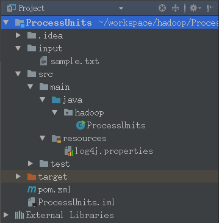
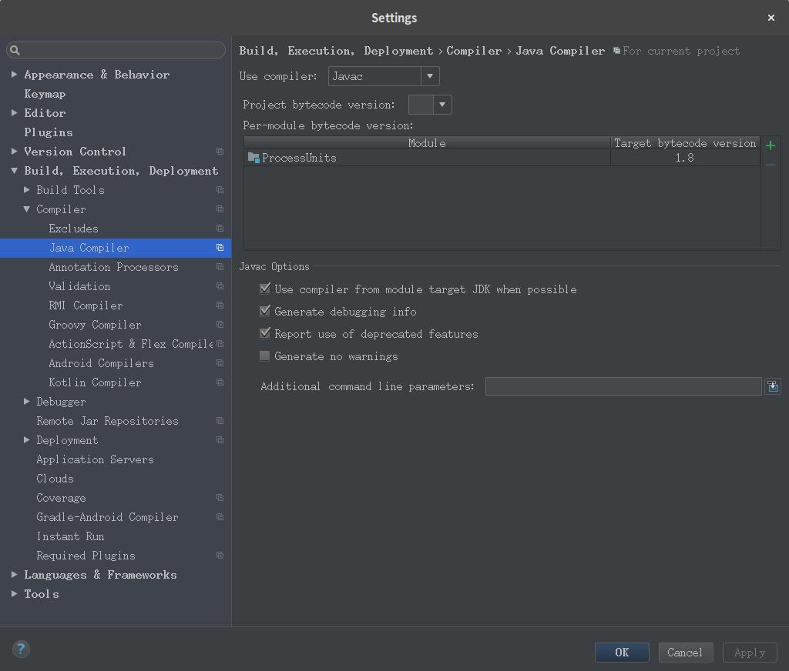
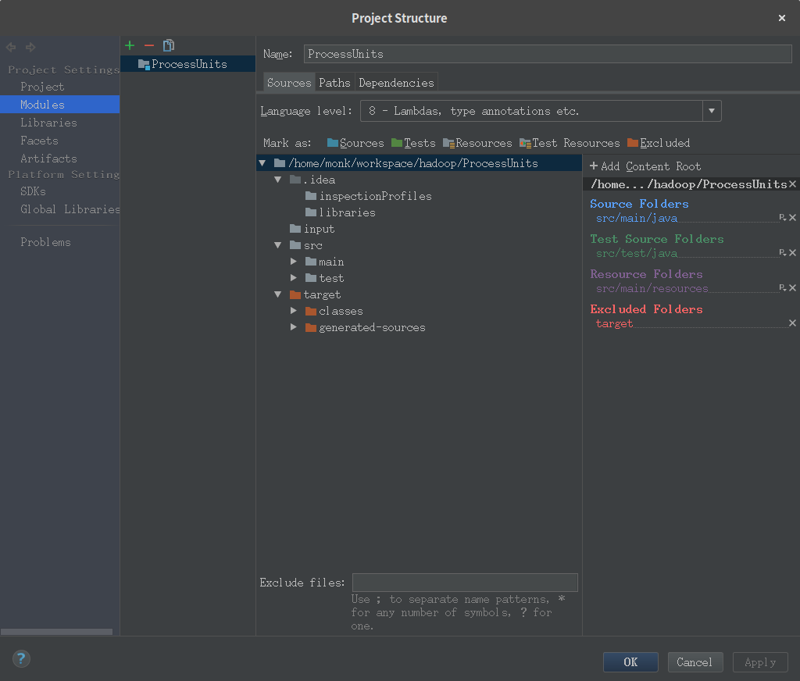
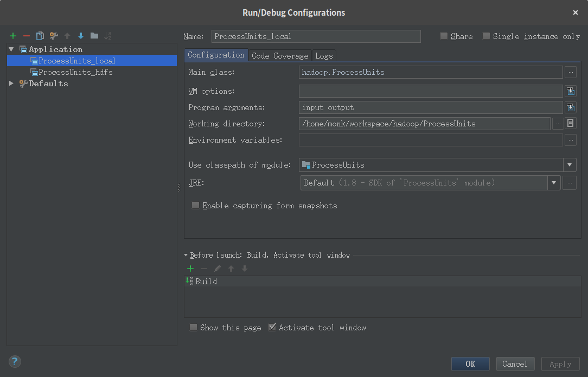
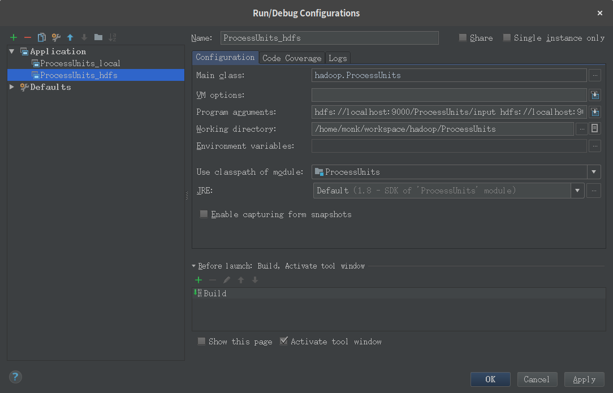
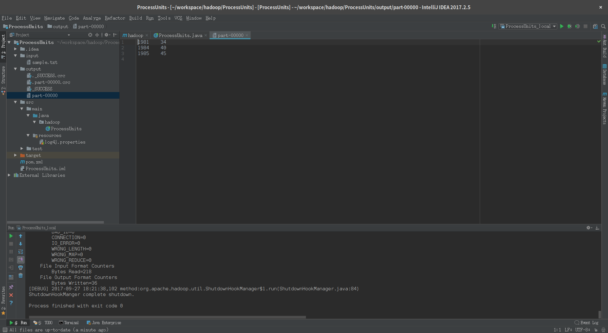
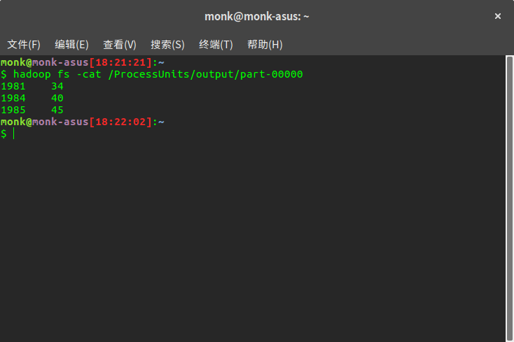

# hadoop 配置记录

> Ubuntu-gnome 16.04 + hadoop version 2.8.1

> 模拟分布式配置

## 环境变量
```bash
export HADOOP_HOME=/opt/hadoop
export HADOOP_MAPRED_HOME=$HADOOP_HOME
export HADOOP_COMMON_HOME=$HADOOP_HOME
export HADOOP_HDFS_HOME=$HADOOP_HOME
export YARN_HOME=$HADOOP_HOME
export HADOOP_COMMON_LIB_NATIVE_DIR=$HADOOP_HOME/lib/native
export HADOOP_OPTS="$HADOOP_OPTS -Djava.library.path=$HADOOP_HOME/lib/native"
export PATH=$PATH:$HADOOP_HOME/sbin:$HADOOP_HOME/bin
export HADOOP_INSTALL=$HADOOP_HOME
```

## 配置文件

```bash
cd $HADOOP_HOME/etc/hadoop
```

* hadoop-env.sh
```bash
export JAVA_HOME=/usr/lib/jvm/java-8-oracle
```

* core-site.xml

```xml
<configuration>
  <property>
    <name>fs.default.name</name>
    <value>hdfs://localhost:9000</value>
  </property>
  <property>
    <name>hadoop.tmp.dir</name>
    <value>file:///home/monk/workspace/hadoop_data/tmp</value>
  </property>
</configuration>
```

* hdfs-site.xml
```xml
<configuration>
  <property>
    <name>dfs.replication</name>
    <value>1</value>
  </property>
  <property>
    <name>dfs.name.dir</name>
    <value>file:///home/monk/workspace/hadoop_data/hdfs/namenode</value>
  </property>
  <property>
    <name>dfs.data.dir</name> 
    <value>file:///home/monk/workspace/hadoop_data/hdfs/datanode</value> 
  </property>
</configuration>
```

* yarn-site.xml
```xml
<configuration>
  <property>
    <name>yarn.nodemanager.aux-services</name>
    <value>mapreduce_shuffle</value> 
  </property>
</configuration>
```

* mapred-site.xml
```bash
cp mapred-site.xml.template mapred-site.xml
```
```xml
<configuration>
  <property>
    <name>mapreduce.framework.name</name>
    <value>yarn</value>
  </property>
</configuration>
```

## 测试

### 环境测试
```bash
cd ~
hdfs namenode -format
start-dfs.sh
start-yarn.sh
```

在浏览器访问Hadoop[http://localhost:50070/](http://localhost:50070/)

验证所有应用程序的集群[http://localhost:8088/](http://localhost:8088/)

### sample测试
```bash
start-dfs.sh
start-yarn.sh
hadoop fs -mkdir /input
hadoop fs -put $HADOOP_HOME/*.txt /input
hadoop fs -ls /input
hadoop jar $HADOOP_HOME/share/hadoop/mapreduce/hadoop-mapreduce-examples-2.8.4.jar wordcount /input /output
hadoop fs -cat /output/part-r-00000
```

### hadoop + intellij 测试
1. 新建Maven工程
2. 配置pom.xml
```xml
<?xml version="1.0" encoding="UTF-8"?>
<project xmlns="http://maven.apache.org/POM/4.0.0"
         xmlns:xsi="http://www.w3.org/2001/XMLSchema-instance"
         xsi:schemaLocation="http://maven.apache.org/POM/4.0.0 http://maven.apache.org/xsd/maven-4.0.0.xsd">
    <modelVersion>4.0.0</modelVersion>

    <groupId>monk</groupId>
    <artifactId>hadoop</artifactId>
    <version>1.0-SNAPSHOT</version>

    <repositories>
        <repository>
            <id>apache</id>
            <url>http://maven.apache.org</url>
        </repository>
    </repositories>

    <dependencies>
        <dependency>
            <groupId>log4j</groupId>
            <artifactId>log4j</artifactId>
            <version>1.2.17</version>
        </dependency>
        <dependency>
            <groupId>org.apache.hadoop</groupId>
            <artifactId>hadoop-common</artifactId>
            <version>2.8.4</version>
        </dependency>
        <dependency>
            <groupId>org.apache.hadoop</groupId>
            <artifactId>hadoop-client</artifactId>
            <version>2.8.4</version>
        </dependency>
        <dependency>
            <groupId>org.apache.hadoop</groupId>
            <artifactId>hadoop-hdfs</artifactId>
            <version>2.8.4</version>
        </dependency>
        <dependency>
            <groupId>org.apache.hadoop</groupId>
            <artifactId>hadoop-mapreduce-client-core</artifactId>
            <version>2.8.4</version>
        </dependency>
        <dependency>
            <groupId>org.apache.hadoop</groupId>
            <artifactId>hadoop-yarn-common</artifactId>
            <version>2.8.4</version>
        </dependency>
    </dependencies>

</project>
```

3. 在src/main/resources下编辑log4j.properties
```properties
log4j.rootLogger = debug,stdout

### 输出信息到控制抬 ###
log4j.appender.stdout = org.apache.log4j.ConsoleAppender
log4j.appender.stdout.Target = System.out
log4j.appender.stdout.layout = org.apache.log4j.PatternLayout
log4j.appender.stdout.layout.ConversionPattern = [%-5p] %d{yyyy-MM-dd HH:mm:ss,SSS} method:%l%n%m%n
```

4. 在src/main/java下建包hadoop，包内建类ProcessUnits.java
```java
package hadoop;

import java.util.*;

import java.io.IOException;

import org.apache.hadoop.fs.Path;
import org.apache.hadoop.io.*;
import org.apache.hadoop.mapred.*;

public class ProcessUnits {
    //Mapper class
    public static class E_EMapper extends MapReduceBase implements
            Mapper<LongWritable,/*Input key Type */
                    Text,                /*Input value Type*/
                    Text,                /*Output key Type*/
                    IntWritable>        /*Output value Type*/ {

        //Map function
        public void map(LongWritable key, Text value,
                        OutputCollector<Text, IntWritable> output,
                        Reporter reporter) throws IOException {
            String line = value.toString();
            String lasttoken = null;
            StringTokenizer s = new StringTokenizer(line, " ");
            String year = s.nextToken();

            while (s.hasMoreTokens()) {
                lasttoken = s.nextToken();
            }

            int avgprice = Integer.parseInt(lasttoken);
            output.collect(new Text(year), new IntWritable(avgprice));
        }
    }


    //Reducer class
    public static class E_EReduce extends MapReduceBase implements
            Reducer<Text, IntWritable, Text, IntWritable> {

        //Reduce function
        public void reduce(Text key, Iterator<IntWritable> values,
                           OutputCollector<Text, IntWritable> output, Reporter reporter) throws IOException {
            int maxavg = 30;
            int val = Integer.MIN_VALUE;

            while (values.hasNext()) {
                if ((val = values.next().get()) > maxavg) {
                    output.collect(key, new IntWritable(val));
                }
            }

        }
    }


    //Main function
    public static void main(String args[]) throws Exception {
        JobConf conf = new JobConf(ProcessUnits.class);

        conf.setJobName("max_eletricityunits");
        conf.setOutputKeyClass(Text.class);
        conf.setOutputValueClass(IntWritable.class);
        conf.setMapperClass(E_EMapper.class);
        conf.setCombinerClass(E_EReduce.class);
        conf.setReducerClass(E_EReduce.class);
        conf.setInputFormat(TextInputFormat.class);
        conf.setOutputFormat(TextOutputFormat.class);

        FileInputFormat.setInputPaths(conf, new Path(args[0]));
        FileOutputFormat.setOutputPath(conf, new Path(args[1]));

        JobClient.runJob(conf);
    }
}
```

5. 在工程目录下建立input文件夹，存放sample.txt
```txt
1979 23 23 2 43 24 25 26 26 26 26 25 26 25
1980 26 27 28 28 28 30 31 31 31 30 30 30 29
1981 31 32 32 32 33 34 35 36 36 34 34 34 34
1984 39 38 39 39 39 41 42 43 40 39 38 38 40
1985 38 39 39 39 39 41 41 41 00 40 39 39 45
```

6. 此时工程的文件如下



7. 配置file->Settyings->Build, Execution, Deployment->Java Compiler，预编译版本



8. 配置file->Project Structure->Project Settings->Modules，语言等级



9. 配置Run/Debug Configurations





10. 运行效果


11. 查看运行结果






## 权限管理

* 以hadoop用户启动dfs，则根目录权限为hadoop:supergroup

* /tmp是每个用户都需要的，赋予777权限
```bash
hadoop fs -mkdir /tmp
hadoop fs -chmod 777 /tmp
```

* 假设给用户userabc:groupabc分配一个工作目录abc

以hadoop用户执行：
```bash
hadoop fs -mkdir /abc
hadoop fs -chown -R userabc /abc
hadoop fs -chgrp -R groupabc /abc
```
