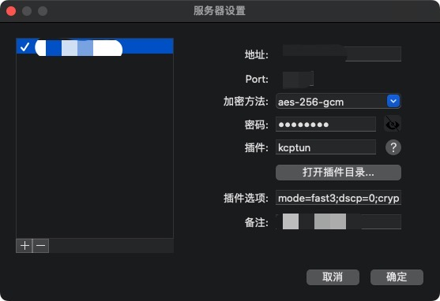

# Proxy

* 代理工具：[Shadowsocks](https://github.com/shadowsocks/shadowsocks/tree/master)
* 加速工具：[kcptun](https://github.com/xtaci/kcptun/releases)
* chrome插件：[Proxy SwitchyOmega](https://chrome.google.com/webstore/detail/proxy-switchyomega/padekgcemlokbadohgkifijomclgjgif?hl=zh-CN)
* 规则列表网址：https://raw.githubusercontent.com/gfwlist/gfwlist/master/gfwlist.txt

## Server

### Linux

1. 使用pip（python>3.6）安装shadowsocks，并创建配置文件/etc/shadowsocks/server.json，将配置写入。
```shell
sudo pip3 install git+https://github.com/shadowsocks/shadowsocks.git@master
sudo mkdir /etc/shadowsocks
sudo nano /etc/shadowsocks/server.json
```

```json
{
    "server": "0.0.0.0",
    "port_password":{
        "8388": "********"
    },
    "timeout": 300,
    "method": "aes-256-gcm"
}
```

2. 配置并启动shadowsocks服务

```shell
sudo nano /etc/systemd/system/shadowsocks.service
```

```ini
[Unit]
Description=Shadowsocks Server Service
After=network.target

[Service]
Type=simple
User=root
ExecStart=/usr/local/bin/ssserver -c /etc/shadowsocks/server.json

[Install]
WantedBy=multi-user.target
```

```shell
sudo systemctl enable shadowsocks.service
sudo systemctl start shadowsocks.service
sudo systemctl status shadowsocks.service
```

3. 下载对应架构的[kcptun](https://github.com/xtaci/kcptun/releases)，并将server挪到/usr/local/bin下。注册kcptun服务。

```shell
sudo nano /etc/systemd/system/kcptun.service
```

```ini
Description=Kcptun Server Service
After=network.target

[Service]
Type=simple
User=root
ExecStart=/usr/local/bin/server_linux_amd64 -l ":39900" -t ":8380" --key=*** --crypt=none --mode=fast3 --mtu=1350 --sndwnd=1024 --rcvwnd=1024 --datashard=10 --parityshard=3 --dscp=0 --nocomp --quiet

[Install]
WantedBy=multi-user.target
```

```shell
sudo systemctl enable kcptun.service
sudo systemctl start kcptun.service
sudo systemctl status kcptun.service
```

## Client

### Linux

1. 使用pip（python>3.6）安装shadowsocks，并创建配置文件/etc/shadowsocks/client.json，将配置写入。

```shell
sudo pip3 install git+https://github.com/shadowsocks/shadowsocks.git@master
sudo mkdir /etc/shadowsocks
sudo nano /etc/shadowsocks/client.json
```

```json
{
    "server": "server_host",
    "server_port": 8388,
    "local_address": "127.0.0.1",
    "local_port": 1080,
    "password": "********",
    "timeout": 300,
    "method": "aes-256-gcm"
}
```

2. 配置并启动shadowsocks服务

```shell
sudo nano /etc/systemd/system/shadowsocks.service
```

```ini
[Unit]
Description=Shadowsocks Client Service
After=network.target

[Service]
Type=simple
User=root
ExecStart=/usr/local/bin/sslocal -c /etc/shadowsocks/client.json

[Install]
WantedBy=multi-user.target
```

```shell
sudo systemctl enable shadowsocks.service
sudo systemctl start shadowsocks.service
sudo systemctl status shadowsocks.service
```

3. 下载对应架构的[kcptun](https://github.com/xtaci/kcptun/releases)，并将client挪到/usr/local/bin下。注册kcptun服务。

```shell
sudo nano /etc/systemd/system/kcptun.service
```

```ini
Description=Kcptun Server Service
After=network.target

[Service]
Type=simple
User=root
ExecStart=/usr/local/bin/client_linux_amd64 -l ":39900" -t ":8380" --key=*** --crypt=none --mode=fast3 --mtu=1350 --sndwnd=512 --rcvwnd=512 --datashard=10 --parityshard=3 --dscp=0 --nocomp --quiet

[Install]
WantedBy=multi-user.target
```

```shell
sudo systemctl enable kcptun.service
sudo systemctl start kcptun.service
sudo systemctl status kcptun.service
```

### MacOS

1. 从[此处](https://github.com/shadowsocks/ShadowsocksX-NG/releases)下载客户端

2. 如图进行配置，插件选择kcptun，



其中插件选项为：
```raw
mode=fast3;dscp=0;crypt=none;parityshard=3;rcvwnd=512;quiet;key=monk_kcptun;sndwnd=512;mtu=1350;datashard=10;nocomp
```

3. 【可选】使用相同版本的kcptun，将下载下来的`client_darwin_amd64`移动到`/Users/monk/Library/Application Support/ShadowsocksX-NG/kcptun_v20190905_1`下，并重命名为`client`.

### Windows

1. 从[此处](https://github.com/shadowsocks/shadowsocks-windows/releases)下载客户端
