# spark

## 需要jdk(略)，强烈建议使用java 8

## 需要hadoop，见[hadoop安装](hadoop.md)

## 需要scala，建议选择与spark对应的版本，查看$SPARK_HOME/jars/scala*

1. 可以使用apt源里的scala

```bash
sudo apt install scala
```

2. 可以去[官网](https://www.scala-lang.org/download/)下载最新版本的scala

解压并拷贝到/opt目录下

```bash
sudo mv scala-2.12.6 /opt/
sudo ln -s scala-2.12.6 scala
```

实际上最后选择了2.11.8，与spark中对应的版本

环境变量
```
export SCALA_HOME=/opt/scala
export PATH=${SCALA_HOME}/bin:${PATH:+:${PATH}}
```

使用update-alternatives安装并配置scala，

```bash
sudo update-alternatives --install /usr/bin/scala scala /opt/scala/bin/scala 100
sudo update-alternatives --config scala
# 如果有多个版本的scala，进行选择配置
```

## 安装spark

去[官网](https://spark.apache.org/downloads.html)下载并解压spark到/opt目录(个人喜好，自行安装的软件放在了/opt目录)，对spark-\*.\*.\*-bin\*文件夹建立软链接到/opt/spark，便于日后更新版本

由于已经安装了hadoop 2.8.4，选择下载安装\[Pre-build with user-provided Apache Hadoop\]spark-2.3.0-bin-without-hadoop.tgz。增加
```bash
export SPARK_DIST_CLASSPATH=$(HADOOP_HOME/bin/hadoop classpath)
```
到SPARK_HOME/conf/spark-env.sh (由spark-env.sh.template复制得到)


环境变量
```bash
export SPARK_HOME=/opt/spark
export PATH=${SPARK_HOME}/sbin:${SPARK_HOME}/bin:${PATH:+:${PATH}}
```

## 测试

从dfs文件系统读取数据，运行前需要启动start-dfs.sh，默认的读取文件方式为hdfs://HOST:PORT/user/USERNAME/PATH/TO/FILE。

从本地系统读取数据，使用 file:///PATH/TO/FILE 读取文件

### 测试（终端）

建立测试用的文件input.txt

> people are not as beautiful as they look, 
>
> as they walk or as they talk.
>
> they are only as beautiful  as they love, 
>
> as they care as they share.


```bash
spark-shell
# 以下为spark-shell中操作
scala> val inputfile = sc.textFile("input.txt")
scala> val counts = inputfile.flatMap(line => line.split(" ")).map(word => (word, 1)).reduceByKey(_+_);
scala> counts.saveAsTextFile("output")
# 打开output文件夹查看输出
cat output/part-*
```

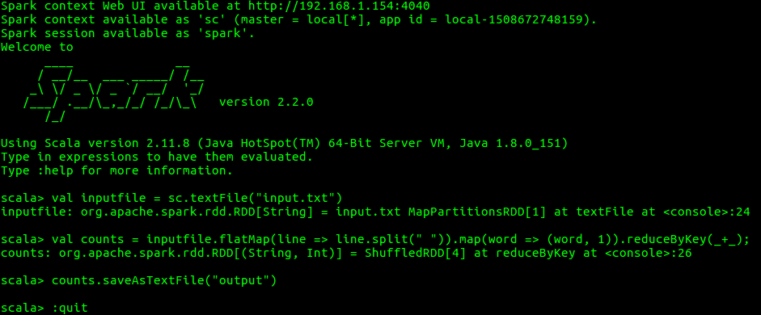

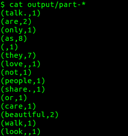

### 测试（程序）

编写scala程序：SparkWordCount.scala
```scala
import org.apache.spark.SparkContext

object SparkWordCount {
  def main(args: Array[String]) {
    /* local = master URL; Word Count = application name; */
    /* /opt/spark = Spark Home; Nil = jars; Map = environment */
    val sc = new SparkContext("local", "word count", "/opt/spark", Nil, Map())
    /*creating an inputRDD to read text file (input.txt) through Spark context*/
    val input_file = sc.textFile(args(0))
    /* Transform the inputRDD into countRDD */
    val count = input_file.flatMap(line => line.split(" "))
      .map(word => (word, 1))
      .reduceByKey(_ + _)
    /* saveAsTextFile method is an action that effects on the RDD */
    count.saveAsTextFile(args(1))
    println("OK")
  }
}
```

编译、打包、测试、查看结果
```bash
scalac -classpath "/opt/spark/jars/*:$(hadoop classpath)" SparkWordCount.scala
jar -cvf SparkWordCount.jar SparkWordCount*.class
spark-submit --class SparkWordCount --master local SparkWordCount.jar file:///home/monk/workspace/spark/input.txt file:///home/monk/workspace/spark/output  # 本地测试
spark-submit --class SparkWordCount --master local SparkWordCount.jar input.txt output  # hdfs测试
```

## 使用Intellij测试

1. 新建Scala SBT工程

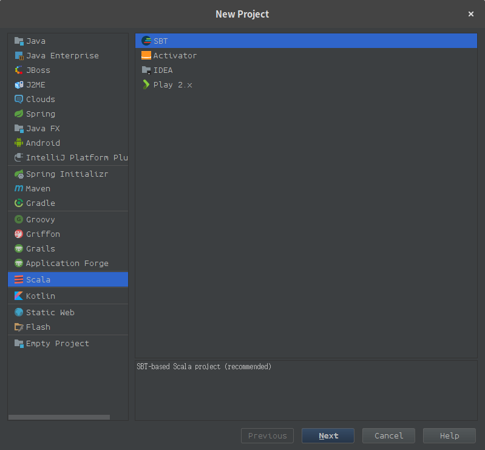

2. 设置工程名称SparkWordCount，选择JDK版本、SBT版本、Scala版本=2.11.8

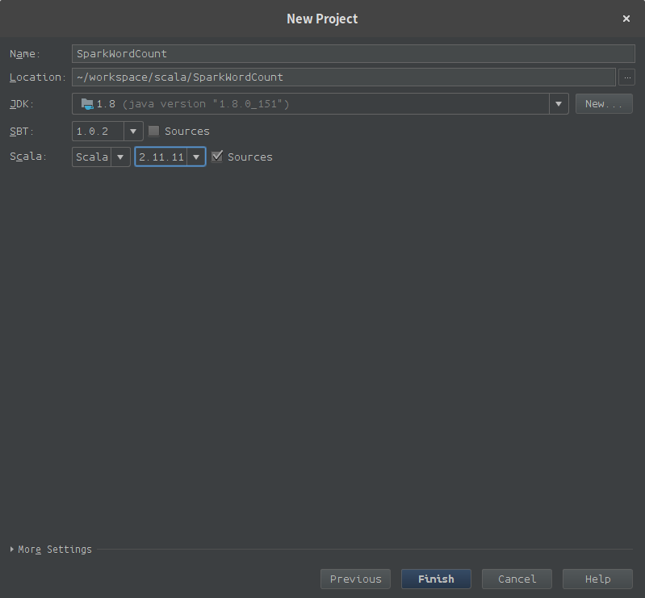

3. 在Project Structure -> Project Settings -> Libraries ，移除SBT；添加Scala SDK，版本选择2.11.8；

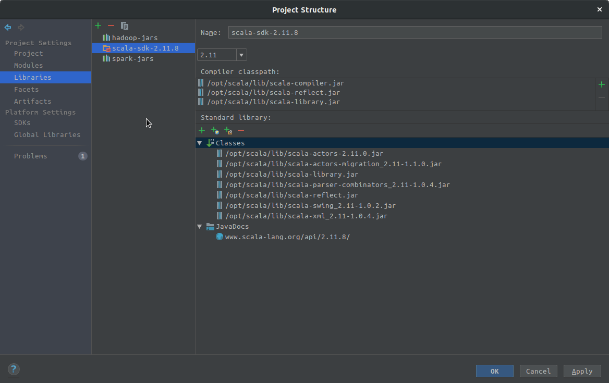

添加java，路径为/opt/spark/jars

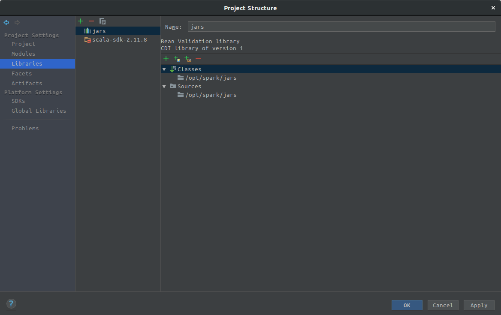

添加java，按照hadoop classpath的结果进行配置

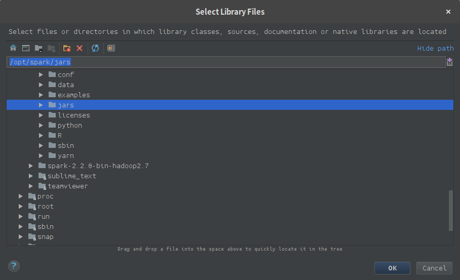

4. 在src/main/scala下新建Scala class，kind选择Object，完成代码SparkWordCount.scala；在工程目录下建立文件input.txt

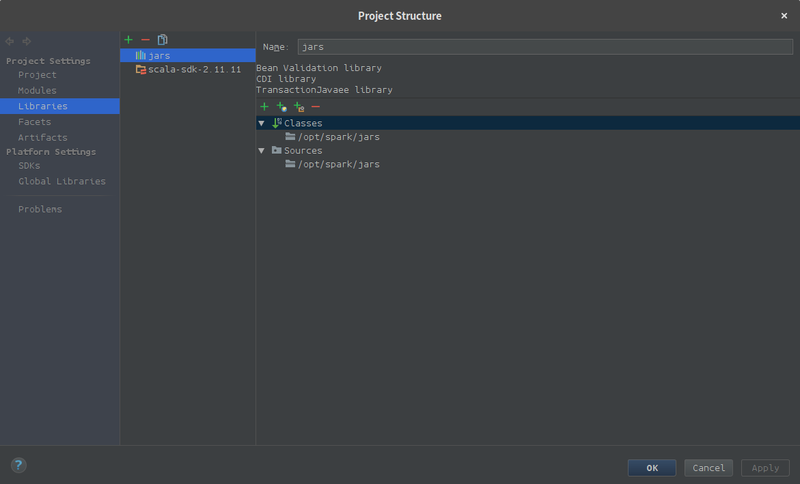

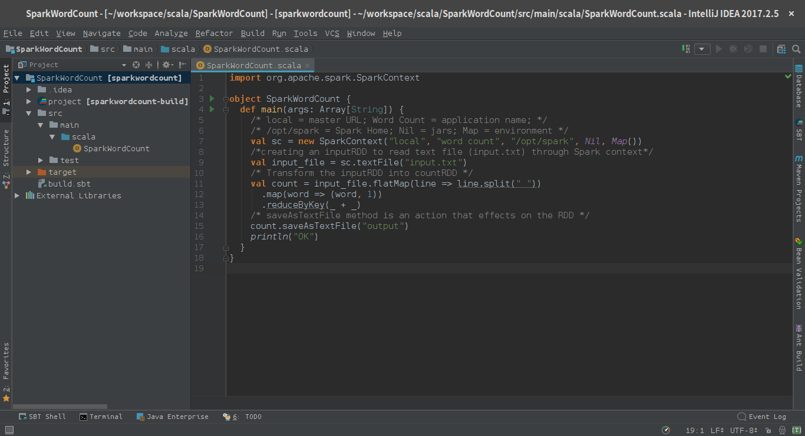

5. 编译并运行，查看结果

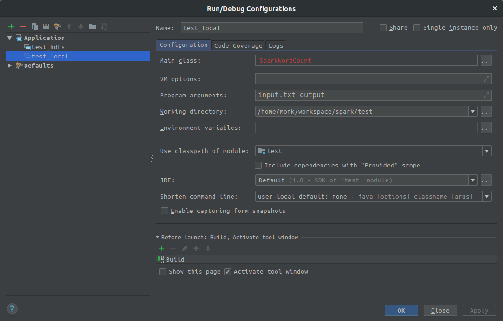

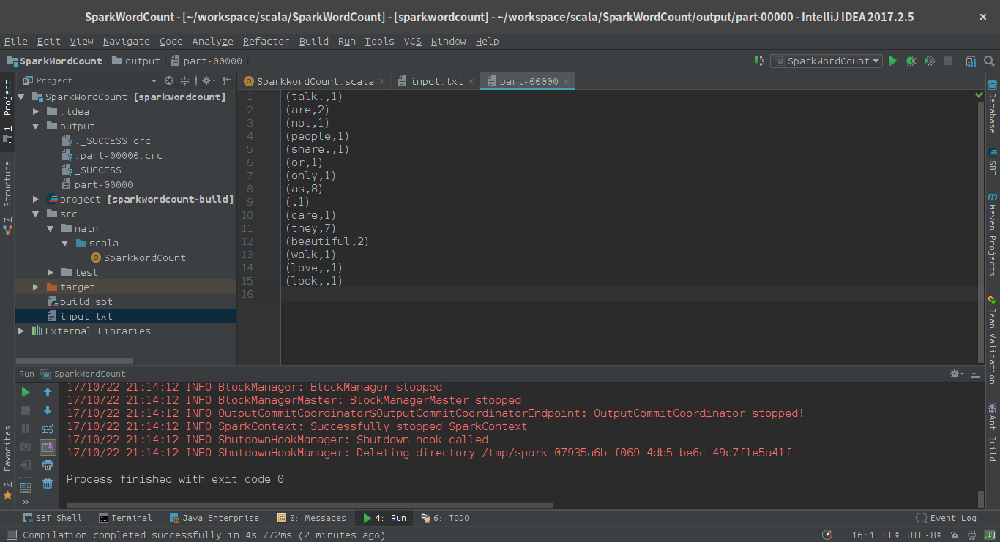

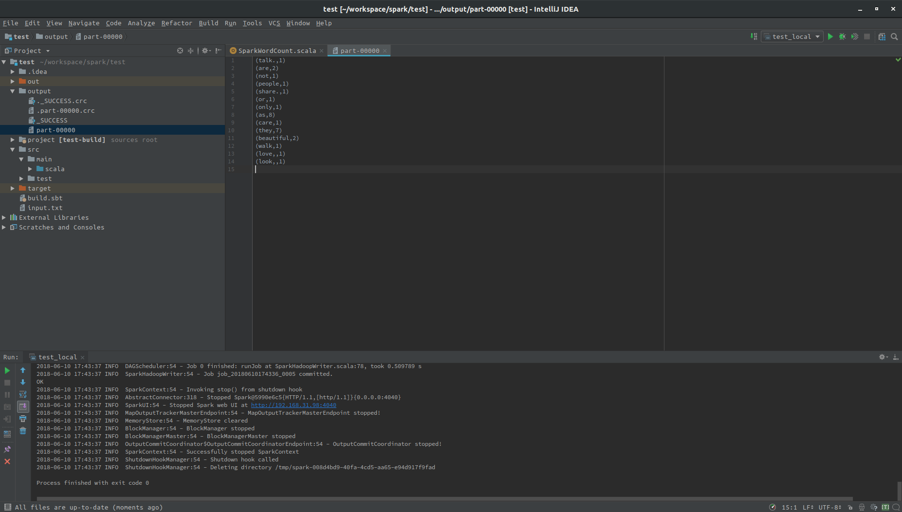

6. 打包，使用spark-submit运行。File->Project Structure->Project Settings->Artifacts，添加JAR->From modules with dependencies...,删除其他包，添加sbt包，使用build->Build Artifacts...进行打包。在out/artifacts/下生成。

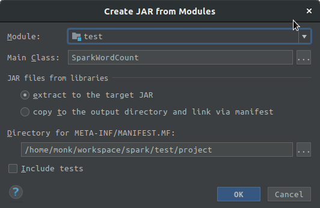

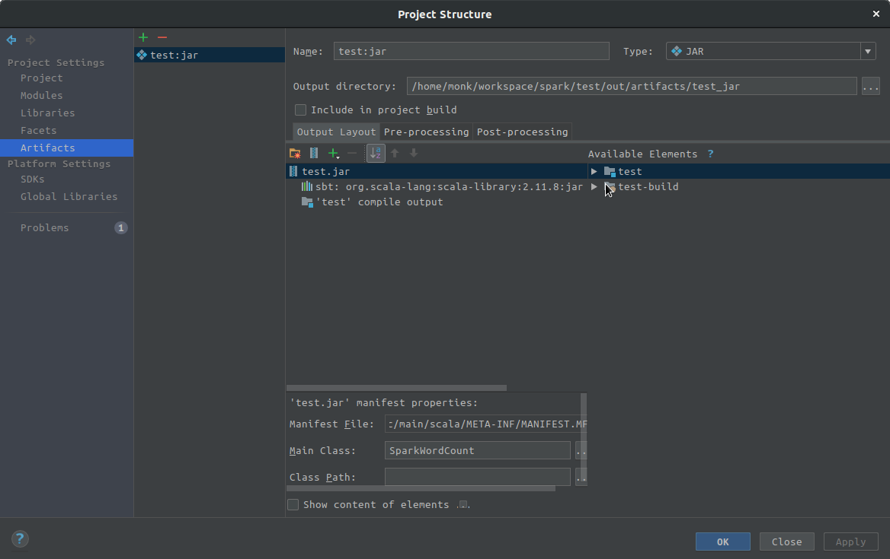

在对应目录下，执行
```bash
spark-submit --class SparkWordCount --master local test.jar input.txt output
```

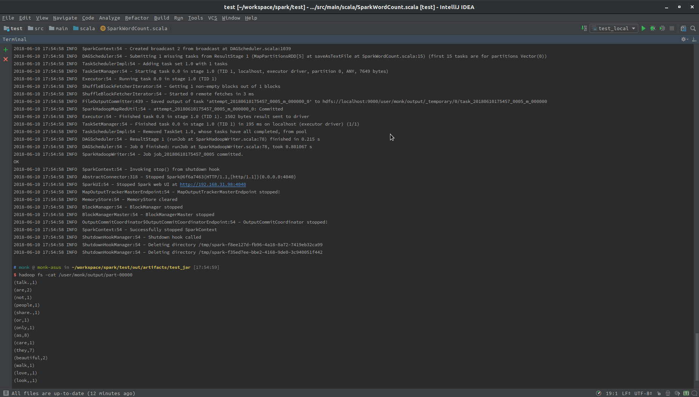

